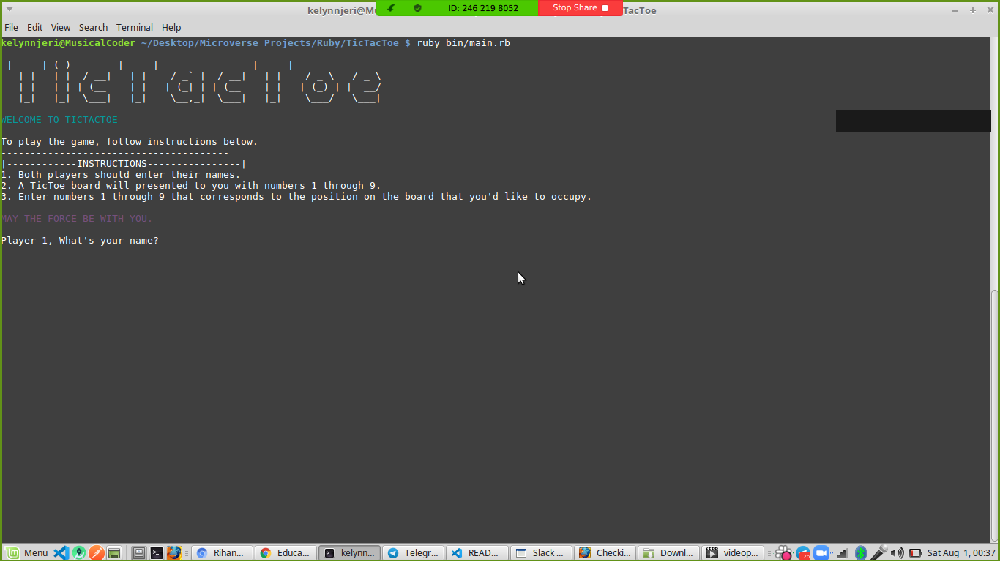

# TicTacToe

> The TicTacToe game is a popular game, commonly know as notts and crosses where players take turn to mark 'Xs' and 'Os' on a 3 * 3 grid.

This whole TicTacToe game is built in Ruby. The main intent for building it was to demonstrate an understanding of Object Oriented Programming(OOP) in Ruby. It consists of the following:
- A `Player` class that's reponsible for the creation of player objects that will be utilized within the program.
- A `GameBoard` class that has various methods such as one to check if the move made is a valid move, another to check if the board is filled and another to check for the winner.
- It also has a `main.rb` file that's responsible for user interaction.

## Built With

-Ruby

## Live Demo

[Live Demo](https://repl.it/@KelynPaul/TicTacToe)

## Getting Started

### Prerequisites
To play the game, you need the following installed:
- Ruby
- Git

### Setup
To get a local copy up and running follow these simple example steps:e reposito
1. Clone/Download the repository using `git clone https://github.com/KelynPNjeri/TicTacToe.git` 
2. Navigate to the folder to which you cloned the game and change directory into the `TicTacToe` directory.
3. Run `bundle install` to get all the gems required for the project.

### Playing the Game
If you have followed the instructions above then to run do the following to have a pleasant gaming experience:

1. To run the game, open your command line and type, `ruby bin/main.rb` to start the game. You will be met by an interactive shell requesting you and your fellow gamer for your names, kindly enter them.
 
2. Once you've entered your names, you would then be prompted to enter your moves. The number you enter should be similar to the unmarked spaces on your board.
**NB: The move has to be an Integer.** 

**Rules**
- The move entered should be an integer.
- Do not attempt to enter a move that is already marked by either an " X " or an " O " since it is an invalid move.

### Run tests
- We are currently working on the tests. However if you'd like to run tests:

1. Run `bundle install` to get all the gems required for the project.
2. From within the project directory, run `rspec`. This run all the testcases.

## Authors

👤 **Kelyn Paul Njeri**

- Github: [@KelynPNjeri](https://github.com/KelynPNjeri)
- Twitter: [@KelynNjeri](https://twitter.com/KelynNjeri)
- Linkedin: [Kelyn Njeri](https://linkedin.com/kelyn-paul)

👤 **Author2**

- Github: [@githubhandle](https://github.com/githubhandle)
- Twitter: [@twitterhandle](https://twitter.com/twitterhandle)
- Linkedin: [linkedin](https://linkedin.com/linkedinhandle)

## 🤝 Contributing

Contributions, issues and feature requests are welcome!

Feel free to check the [issues page](issues/).

## Show your support

Give a ⭐️ if you like this project!

## Acknowledgments

- Microverse
- Team Ocicats

## 📝 License

This project is unlicensed.
